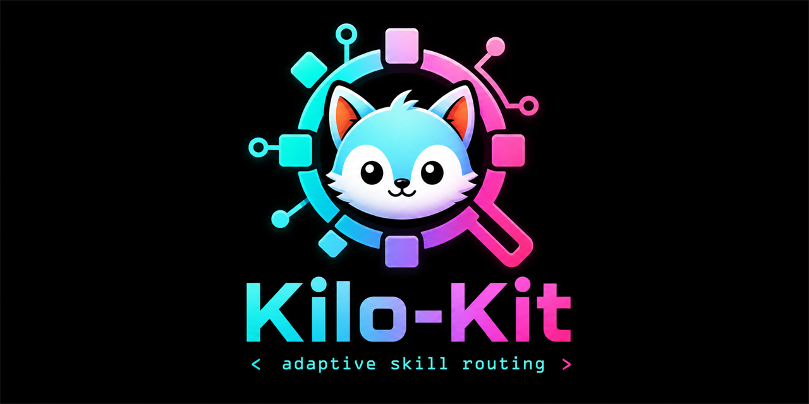

<p align="center">
  
</p>

<p align="center">
  <a href="https://github.com/VoDaiLocz/KILO-KIT/stargazers"></a>
  <a href="https://github.com/VoDaiLocz/KILO-KIT/commits/main"></a>
  <a href="https://github.com/VoDaiLocz/KILO-KIT/graphs/contributors"></a>
  <a href="https://github.com/VoDaiLocz/KILO-KIT/actions/workflows/publish.yml"></a>
  <a href="https://www.npmjs.com/package/@vodailoc/kilo-kit-mcp"></a>
  <a href="https://www.npmjs.com/package/@vodailoc/kilo-kit-mcp"></a>
  <a href="LICENSE"></a>
</p>

<p align="center">
  
  
  
  
  =20">
  
</p>

# 🚀 Kilo-Kit: Professional AI Agent Development Framework

> **Version:** 1.0.0  
> **Author:** Kilo-Kit Team  
> **License:** Apache 2.0

## 🎯 What is Kilo-Kit?

**Kilo-Kit** is a comprehensive, modular framework for building and managing AI agent systems at scale (kilo-code = thousands of lines, hundreds of files). It introduces a revolutionary **Cognitive Flow Architecture (CFA)** that treats AI interactions as continuous flows rather than discrete events.

### Core Philosophy

```
🧠 "Anticipate needs before they arise"
🔄 "Learn from every interaction"
📐 "Modularity enables scalability"
🎯 "Quality over quantity in every token"
💰 "Cost-aware intelligence"
```

## ✨ Key Innovations

| Innovation | Description |
|------------|-------------|
| **Predictive Context Engine (PCE)** | Pre-loads context before you need it |
| **Composable Behavior Units (CBU)** | Build workflows from micro-behaviors |
| **Token Economy Manager (TEM)** | Smart budgeting for cost/quality balance |
| **Decision Audit Trail (DAT)** | Full explainability for all decisions |
| **Skill Effectiveness Tracker (SET)** | Self-improving skill system |
| **Adaptive Routing** | Learns optimal skill selection over time |

## ✨ Key Features

| Feature | Description |
|---------|-------------|
| **Skill System** | Modular, loadable skills for specialized tasks |
| **Adaptive Dispatch** | Intelligent skill routing that learns from usage |
| **Progressive Disclosure** | Three-level context loading for efficiency |
| **Context Engineering** | Token optimization and attention management |
| **Quality Gates** | Mandatory checkpoints: typecheck → lint → test → build |
| **TDD Workflow** | Test-first development with RED → GREEN → REFACTOR |
| **Security First** | Input validation, parameterized queries, no hardcoded secrets |
| **Multi-Stack Support** | TypeScript, Python, .NET, Go ready |

## 💡 Skill Library

`skills/` is the canonical workflow surface for Kilo-Kit. It supports the same **Progressive Disclosure** model as the core framework: scan the index first, load one skill body when routed, then open references/scripts only when needed.

| Layer | Purpose |
|-------|---------|
| `skills/kilo-kit/` | Core Kilo-Kit framework skills and Hard-Gate workflows |
| `skills/<category>/<skill>/` | Expanded skill library organized by execution domain |
| `skills/README.md` | Human-facing catalog with category summaries and install commands |
| `skills/SKILLS_INDEX.md` | Lightweight agent index for Predictive Context Engine prefetching |

### Install the Full Skill Library

This installs every valid `SKILL.md` under `skills/`, including Kilo-Kit core skills and the expanded category library.

```bash
npx skills@latest add VoDaiLocz/KILO-KIT
```

Use this when you want the entire Kilo-Kit workflow surface available in your agents.

### Install a Category

Use a category path when you only want one execution domain:

```bash
npx skills@latest add VoDaiLocz/KILO-KIT/skills/engineering
```

### Install a Single Skill

```bash
npx skills@latest add VoDaiLocz/KILO-KIT/skills/engineering/tdd
```

## 📁 Project Structure

```
kilo-kit/
├── README.md                    # This file
├── QUICKSTART.md               # 15-minute getting started guide
├── CONTRIBUTING.md             # Contribution guidelines
├── CHANGELOG.md                # Version history
│
├── .claude-plugin/             # Claude Code entry point
│   └── instructions.md
├── .cursor-plugin/             # Cursor IDE entry point
│   └── instructions.md
├── .codex/                     # OpenAI Codex entry point
│   └── instructions.md
├── .opencode/                  # OpenCode entry point
│   └── instructions.md
│
├── skills/                     # Installable skill packs
│   ├── README.md               # Human-facing skill catalog
│   ├── SKILLS_INDEX.md         # Lightweight agent skill index
│   ├── kilo-kit/               # Core Kilo-Kit skills
│   │   ├── _template/          # Skill template
│   │   ├── debugging/          # Debugging skills
│   │   ├── development/        # Development skills
│   │   └── quality/            # Quality assurance skills
│   ├── engineering/            # Engineering and framework skills
│   ├── productivity/           # Agent workflow skills
│   ├── problem-solving/        # Debugging/reasoning skills
│   ├── design/                 # UI/design skills
│   └── ...                     # Games, ops, docs, AI media, security
│
├── commands/                   # Workflow commands
│   ├── quality-gate.md         # Quality gate workflow
│   ├── init-skill.md           # Skill initialization
│   └── validate-skill.md       # Skill validation
│
├── src/                        # Core system source
│   ├── core/                   # Core system components
│   │   ├── KILO_MASTER.md     # Master skill file (entry point)
│   │   ├── predictive-engine/  # Predictive Context Engine
│   │   ├── routing-engine/     # Adaptive Routing Engine
│   │   ├── execution-engine/   # Execution & Quality Gates
│   │   └── knowledge-layer/    # Persistent Knowledge
│   │
│   ├── behaviors/              # Composable Behavior Units
│   │   ├── atomic/             # Smallest behavior units
│   │   ├── compound/           # Combined behaviors
│   │   └── meta/               # Meta-behaviors
│   │
│   └── tools/                  # CLI and utility tools
│       ├── init-skill.py       # Skill initializer
│       ├── validate-skill.py   # Skill validator (Python)
│       └── validate-skill.js   # Skill validator (Node.js)
│
├── docs/                       # Documentation
│   ├── architecture/           # Architecture decisions
│   ├── COMPLETION_ASSESSMENT.md
│   ├── DEEP_ANALYSIS.md
│   └── PROJECT_STRUCTURE.md
│
└── examples/                   # Real-world examples
    ├── basic/                  # Basic usage patterns
    ├── intermediate/           # Intermediate patterns
    └── advanced/               # Advanced patterns
```

## 🚀 Quick Start

### 1. Install

```bash
# Clone the repository
git clone https://github.com/VoDaiLocz/KILO-KIT.git
cd kilo-kit

# No dependencies required - works out of the box!
```

### 2. Configure Your Agent

Copy the master skill file to your agent's configuration:

```bash
# For most AI agents
cp src/core/KILO_MASTER.md ~/.your-agent/KILO_MASTER.md

# Update your agent's system prompt to reference it
```

### 3. Use Skills

Skills are automatically loaded when your task matches their keywords. See the [Skill Dispatch Table](#-skill-dispatch-table) below.

## 🔌 MCP Integration

Kilo-Kit v1.1.1 includes a read-only MCP server that exposes the skill library as an adaptive routing service for MCP-capable agents.

| MCP Surface | Purpose |
|-------------|---------|
| `kilo_route_intent` | Route the current chat request to the best Kilo-Kit skills |
| `kilo_search_skills` | Search the skill catalog by task or keyword |
| `kilo_get_skill` | Load one exact `SKILL.md` with context-safe truncation |
| `kilo_validate_skills` | Run the skill validation quality gate |
| `kilo://skills/index` | Resource view of the lightweight skill index |
| `kilo://skills/{category}/{skill}` | Resource view for one skill |

Install from npm in any MCP-capable client:

```json
{
  "mcpServers": {
    "kilo-kit": {
      "command": "npx",
      "args": ["-y", "@vodailoc/kilo-kit-mcp"]
    }
  }
}
```

Recommended Codex CLI config on Windows:

```toml
[mcp_servers.kilo-kit]
command = "npm"
args = ["exec", "--prefix", "C:\\Users\\Admin", "--yes", "--package=@vodailoc/kilo-kit-mcp", "--", "kilo-kit-mcp"]
startup_timeout_sec = 60
enabled = true
```

The `--prefix` keeps npm from resolving the local source checkout when Codex is opened inside the Kilo-Kit repository.

For local development, build and verify:

```bash
cd mcp
npm install
npm run build
npm test
npm run smoke
```

Local client config template:

```json
{
  "mcpServers": {
    "kilo-kit": {
      "command": "node",
      "args": ["<absolute-path-to-KILO-KIT>/mcp/dist/server.js"],
      "env": {
        "KILO_KIT_REPO_ROOT": "<absolute-path-to-KILO-KIT>"
      }
    }
  }
}
```

See [mcp/README.md](./mcp/README.md) and [.mcp/kilo-kit.example.json](./.mcp/kilo-kit.example.json).

### Maintainer Release Flow

Kilo-Kit publishes `@vodailoc/kilo-kit-mcp` through npm Trusted Publishing. Configure npm once with:

| Field | Value |
|-------|-------|
| Provider | GitHub Actions |
| Repository | `VoDaiLocz/KILO-KIT` |
| Workflow filename | `publish.yml` |

After that, run the GitHub Actions workflow `Publish npm package`, or push a version tag such as `v1.1.1`. The workflow uses OIDC, so it does not need an npm token or interactive OTP.

## 📋 Skill Dispatch Table

| Task Keywords | Skill to Load |
|---------------|---------------|
| `bug, error, fix, debug` | `skills/kilo-kit/debugging/systematic/` |
| `validate, validation` | `skills/kilo-kit/debugging/systematic/` |
| `root cause, why` | `skills/kilo-kit/debugging/root-cause/` |
| `verify, confirm` | `skills/kilo-kit/debugging/verification/` |
| `review, PR, code review` | `skills/kilo-kit/quality/code-review/` |
| `test, TDD, testing` | `skills/kilo-kit/quality/testing/` |
| `security, auth, OWASP` | `skills/kilo-kit/development/security/` |
| `API, backend, server` | `skills/kilo-kit/development/backend/` |

## 🎓 Core Principles

### 1. Cognitive Flow Architecture

```
Traditional:  Task → Process → Response (done)

Kilo-Kit:     ┌─────────────────────────────┐
              │      COGNITIVE FLOW         │
              │                             │
    Input ───►│  Predict → Execute → Learn  │───► Output
              │      ↑              │       │
    Next  ───►│      └──────────────┘       │───► Better
              │                             │
              └─────────────────────────────┘
```

### 2. Quality Gates (NEVER SKIP)

```bash
# Before EVERY commit
typecheck → lint → test → build

# All must pass. No exceptions.
```

### 3. The Three Pillars

```
ANTICIPATE → EXECUTE → LEARN → OPTIMIZE
     ↑                            │
     └────────────────────────────┘
```

### 4. Progressive Disclosure

```
Level 1: Metadata (always loaded, ~100 tokens)
Level 2: SKILL.md body (when triggered, <5k tokens)  
Level 3: References/Scripts (on-demand, unlimited)
```

## 🔧 Creating Custom Skills

Use the skill template:

```bash
python src/tools/init-skill.py my-skill --path ./skills/kilo-kit/
```

This creates:

```
my-skill/
├── SKILL.md           # Main instructions (required)
├── references/        # Documentation to load as needed
├── scripts/           # Executable utilities
└── assets/            # Templates, images, etc.
```

### SKILL.md Format

```yaml
---
name: my-skill
description: >-
  Clear description of what this skill does and when to use it.
  Include keywords that should trigger this skill.
version: 1.0.0
behaviors: [behavior1, behavior2]
token_estimate:
  min: 500
  typical: 1500
  max: 5000
---

# My Skill

## When to Use
- Situation 1
- Situation 2

## Process
1. Step 1
2. Step 2

## Guidelines
- Guideline 1
- Guideline 2

## References
- `references/detailed-guide.md` - For detailed instructions
- `scripts/helper.py` - For automated tasks
```

## 📚 Documentation

- **[QUICKSTART.md](./QUICKSTART.md)** - Get started in 15 minutes
- **[docs/architecture/](./docs/architecture/)** - Architecture design documents
- **[docs/PROJECT_STRUCTURE.md](./docs/PROJECT_STRUCTURE.md)** - Project structure guide
- **[examples/](./examples/)** - Real-world usage examples

## 🤝 Contributing

We welcome contributions! Please read [CONTRIBUTING.md](./CONTRIBUTING.md) for:

- Code of conduct
- Development setup
- Pull request process
- Coding standards

## 📊 Stack Preferences

### TypeScript/JavaScript (2024-2025)
| Category | Preferred | Avoid |
|----------|-----------|-------|
| Runtime | Bun, Node 20+ | Node <18 |
| Backend | Hono, Elysia | Express |
| ORM | Drizzle, Prisma 5+ | Sequelize |
| Testing | Vitest, Playwright | Jest |
| Package | pnpm, Bun | npm |

### Python
| Category | Preferred | Avoid |
|----------|-----------|-------|
| Runtime | Python 3.11+ | <3.9 |
| Backend | FastAPI, Litestar | Flask |
| ORM | SQLAlchemy 2.0 | <2.0 |
| Validation | Pydantic v2 | v1 |
| Linting | Ruff, mypy | flake8 |

### .NET
| Category | Preferred |
|----------|-----------|
| Framework | .NET 8+ |
| Web | ASP.NET Core |
| ORM | EF Core |
| Testing | xUnit, NUnit |

## 🏗️ Roadmap

- [x] v1.0.0 - Core Cognitive Flow Architecture
- [x] v1.1.0 - MCP Integration
- [ ] v1.2.0 - Multi-Agent Orchestration
- [ ] v2.0.0 - Visual Workflow Builder

## 📄 License

Apache 2.0 - See [LICENSE](./LICENSE) for details.

---

**Made with ❤️ for developers who value quality, efficiency, and scalability.**

*Kilo-Kit — Where AI meets excellence.*
