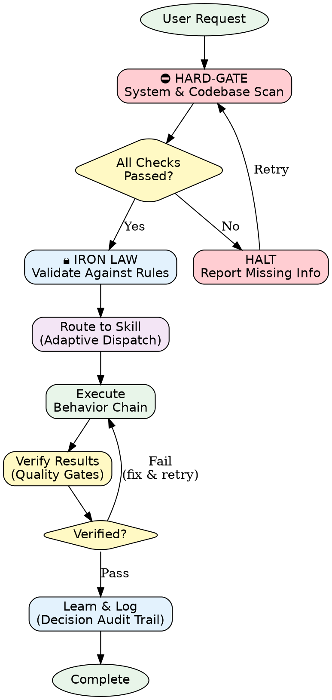
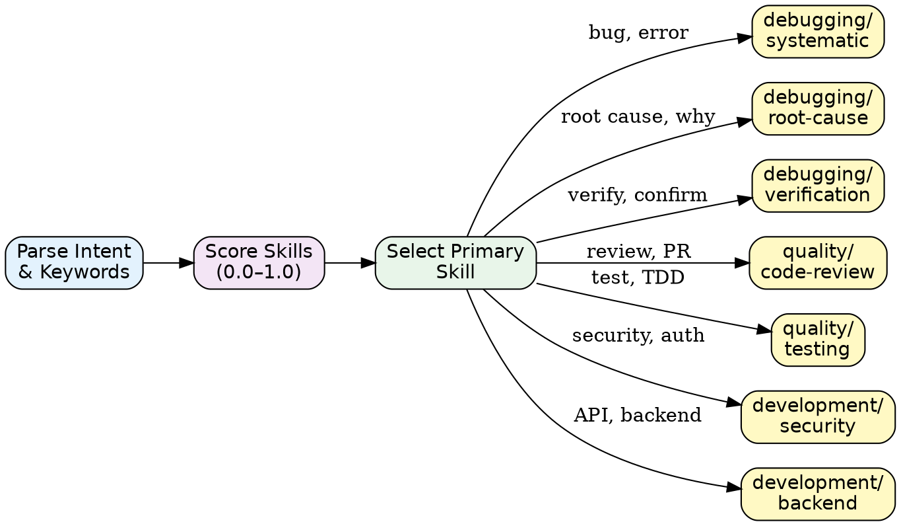
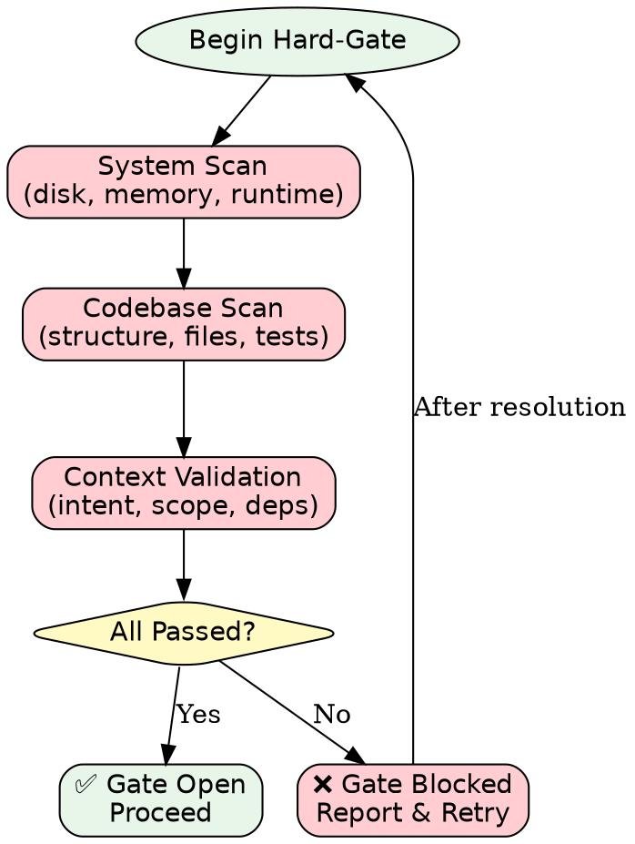

# 🛡️ Kilo-Kit Core Skill — Hard-Gate & Iron Law

> **Philosophy:** "Evidence over Guessing" — No agent action without verified evidence.

## When to Use

Use this skill when:
- Starting **any** new task or user request
- Proposing architectural or code changes
- Diagnosing bugs or performance issues
- Making decisions that affect production systems

**Do NOT use this skill when:**
- Answering simple factual questions from memory
- Formatting or styling-only changes with no logic impact

---

## Prerequisites

Before using this skill, ensure:
- [ ] Access to the project codebase is available
- [ ] System resource checks can be performed (disk, memory, processes)
- [ ] Relevant logs or error outputs are accessible

---

## ⛔ HARD-GATE — Mandatory System Scan

> **Rule:** The AI agent **MUST** scan the system and codebase **before** proposing any solution.
> Failure to pass the Hard-Gate means the agent **cannot proceed** to execution.

### Hard-Gate Checklist

```yaml
hard_gate:
  system_scan:
    - [ ] Check available disk space
    - [ ] Check running processes and resource usage
    - [ ] Verify runtime versions (Node, Python, .NET, etc.)
    - [ ] Confirm network/service availability if needed

  codebase_scan:
    - [ ] Read project structure (top-level directories)
    - [ ] Identify relevant files for the current task
    - [ ] Check existing tests related to the change area
    - [ ] Review recent git history for context on affected files

  context_validation:
    - [ ] Confirm understanding of the user's intent
    - [ ] Verify the task scope matches the request
    - [ ] Identify dependencies that may be affected
```

### Hard-Gate Decision

```
IF all_checks_passed:
    → PROCEED to execution
ELSE:
    → HALT and report which checks failed
    → Request missing information or access
    → Re-run Hard-Gate after resolution
```

---

## 🔒 Iron Law — Invariant Rules

> These rules are **absolute** and **cannot be overridden** under any circumstance.

### The Seven Iron Laws

| # | Law | Description |
|---|-----|-------------|
| 1 | **No Action Without Evidence** | Every proposed change must cite specific files, lines, or outputs as evidence. |
| 2 | **Scan Before You Speak** | Run system and codebase scans before making any recommendation. |
| 3 | **Verify Before You Claim** | Never claim a task is complete without running verification (tests, build, manual check). |
| 4 | **Minimal Blast Radius** | Make the smallest change that solves the problem. Avoid unnecessary modifications. |
| 5 | **Preserve What Works** | Never delete or modify working code unless directly required by the task. |
| 6 | **Trace Every Decision** | Log the reasoning behind each decision in the Decision Audit Trail. |
| 7 | **Fail Loud, Recover Fast** | If something fails, report it immediately with full context. Never hide errors. |

### Iron Law Enforcement

```yaml
enforcement:
  violation_response:
    - Log the violation in the Decision Audit Trail
    - Halt current execution
    - Return to the Hard-Gate phase
    - Report the violation to the user

  no_exceptions:
    - Task urgency does NOT override Iron Laws
    - User requests do NOT override Iron Laws
    - Performance pressure does NOT override Iron Laws
```

---

## 🔀 Process Flow

### Main Processing Flow



### Skill Dispatch Flow



### Hard-Gate Scan Flow



---

## Guidelines

### DO ✅
- Always run Hard-Gate checks before starting any task
- Cite specific evidence (file paths, line numbers, command outputs) in every recommendation
- Use the smallest possible change to solve the problem
- Log all decisions in the Decision Audit Trail
- Verify results before claiming completion

### DON'T ❌
- Skip system or codebase scans, regardless of task urgency
- Guess at solutions without checking the actual code
- Make changes to files unrelated to the task
- Claim completion without running verification
- Override Iron Laws for any reason

---

## Common Patterns

### Pattern 1: Pre-Flight Evidence Gathering

**When:** Starting any new task.

**Action:** Execute the Hard-Gate scan sequence.

```bash
# System scan
df -h                          # Disk space
free -m                        # Memory
node --version && python3 --version  # Runtimes

# Codebase scan
find . -maxdepth 2 -type f | head -50  # Project structure
git log --oneline -10                   # Recent changes
```

### Pattern 2: Evidence-Backed Recommendation

**When:** Proposing a code change.

**Action:** Always include the specific evidence.

```markdown
## Recommendation
Change `src/auth/login.ts:42` from direct string concatenation to parameterized query.

**Evidence:**
- File: `src/auth/login.ts`, line 42
- Current code: `db.query("SELECT * FROM users WHERE email = '" + email + "'")`
- Risk: SQL injection (OWASP A03:2021)
- Test: `tests/auth/login.test.ts` — no injection test exists
```

---

## Anti-Patterns (AVOID)

### Anti-Pattern 1: Blind Recommendation

**Problem:** Suggesting changes without reading the actual code first.

**Instead:** Always read the relevant files and cite specific lines before recommending.

### Anti-Pattern 2: Skip-the-Gate

**Problem:** Rushing to execution because the task seems simple.

**Instead:** Run Hard-Gate scans regardless of perceived task complexity.

### Anti-Pattern 3: Invisible Reasoning

**Problem:** Making decisions without documenting the reasoning.

**Instead:** Log every decision with evidence and alternatives considered.

---

## Error Handling

| Error Type | Cause | Solution |
|------------|-------|----------|
| Hard-Gate Failure | Missing system access or information | Report which checks failed; request access |
| Iron Law Violation | Attempted action without evidence | Halt, return to Hard-Gate, log violation |
| Skill Mismatch | Wrong skill selected for the task | Re-route through Adaptive Dispatch |
| Verification Failure | Changes don't pass quality gates | Fix the issue, re-run verification |

---

## Success Criteria

Before claiming completion, verify:

- [ ] Hard-Gate scan was performed and passed
- [ ] All Iron Laws were followed throughout the task
- [ ] Every recommendation cites specific evidence
- [ ] Changes are minimal and focused on the task
- [ ] Verification (tests, build, manual check) has passed
- [ ] Decision Audit Trail is complete
- [ ] User request is fully addressed

---

## References

- `references/patterns.md` - Reusable patterns for evidence-based workflows
- `references/performance-benchmarks.md` - System and codebase scan benchmarks
- `references/output-formats.md` - Standard output format definitions

---

## Related Skills

- `skills/kilo-kit/debugging/systematic/` - For systematic bug diagnosis
- `skills/kilo-kit/debugging/root-cause/` - For deep root cause analysis
- `skills/kilo-kit/debugging/verification/` - For verifying fixes
- `skills/kilo-kit/quality/code-review/` - For code review workflows
- `skills/kilo-kit/quality/testing/` - For test-driven development
- `skills/kilo-kit/development/security/` - For security best practices
- `skills/kilo-kit/development/backend/` - For backend development

---

## Feedback Integration

If this skill was:

**Successful:**
- Record which Hard-Gate checks were most valuable
- Note which Iron Laws prevented mistakes
- Log the evidence patterns that worked best

**Unsuccessful:**
- Document which checks were insufficient
- Identify gaps in the Hard-Gate checklist
- Flag for skill improvement

---

*Kilo-Kit Core Skill v1.0.0 — Evidence over Guessing*
